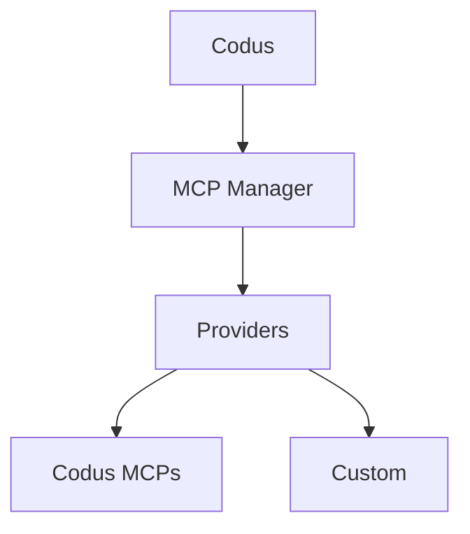

## ¿Qué son los MCPs?

Model Context Protocol (MCP) es un estándar abierto que permite a las aplicaciones de LLM conectarse a
herramientas externas y fuentes de datos a través de una interfaz de servidor consistente. Los servidores
MCP publican esquemas de herramientas y endpoints para que clientes como Codus/Cody puedan obtener
contexto o ejecutar acciones durante un flujo de trabajo.

## Arquitectura de MCP Manager

MCP Manager es el servicio backend que gestiona esas conexiones MCP para
Codus. Lleva un registro de los proveedores, integraciones y herramientas permitidas por
workspace, y luego expone ese catálogo a la API de Codus.

- Registro central de proveedores MCP (Codus y personalizados)
- Almacena metadatos de integración (estado de conexión, URL MCP, herramientas permitidas)
- Gestiona los flujos de autenticación específicos de cada proveedor y el descubrimiento de herramientas
- Expone APIs que Codus usa para listar e invocar herramientas MCP

## Plugins en Codus

Todo lo registrado en MCP Manager aparece en la pantalla de **Plugins** de Codus,
para que tu equipo pueda instalar, gestionar y habilitar los MCPs disponibles para cada
workspace.

## Proveedores

### Proveedor Codus

El proveedor Codus agrupa los MCPs de primera parte gestionados por Codus, incluyendo el
Codus MCP, Context7 MCP y Codus Docs MCP.

### Proveedores personalizados

Puedes agregar proveedores personalizados para integrar sistemas internos o plataformas de terceros.
En despliegues auto-hospedados, lista el proveedor en
`API_MCP_MANAGER_MCP_PROVIDERS` y luego implementa el proveedor en el código fuente de MCP Manager.
La implementación de referencia se encuentra aquí:
[repositorio codus-mcp-manager](https://github.com/elchapita43/codus-mcp-manager#-adding-a-new-provider)
