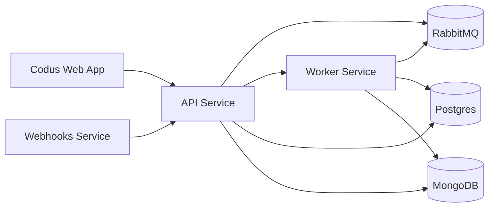

## 概要

このドキュメントでは、Codusのインフラストラクチャを支えるアーキテクチャについて説明します。当システムはコンテナ化とネットワーク分割を活用した分散アーキテクチャで構築されており、最大限のスケーラビリティ、セキュリティ、保守性を確保しています。

## ネットワークと主要コンポーネント

インフラストラクチャは、パブリックアクセスと内部サービストラフィックを分離するDockerネットワークに分割されています：

- shared-network: 公開サービスとエッジルーティング
- codus-backend-services: サービス間内部通信
- monitoring-network: メトリクスとオブザーバビリティトラフィック（オプション）

## コンポーネント

### 1. Codus Webアプリケーション

フロントエンドプラットフォームはNext.jsで構築されており、APIレイヤーとの直接通信によってシームレスなユーザー体験を提供します。

### 2. コアバックエンドサービス

2.0スタックでは、バックエンドの責務を専用サービスに分割しています：

- API: ビジネスロジックとリクエスト処理を担う中央サービスレイヤー
- Worker: キューとバックグラウンドジョブの非同期処理
- Webhooks: GitプロバイダーWebhookの専用サービス
- Analytics Worker: Cockpit のダッシュボードを支える任意のインジェストワーカー（`WORKER_ROLE=analytics`）。Enterprise 限定 — [Analytics Worker](/how_to_deploy/ja/deploy_codus/analytics_worker) を参照

### 3. MCP Manager

MCP Managerはプロバイダーとインテグレーションをカタログ化し、Codusに公開することで、チームがPlugins画面からMCPをインストールできるようにします。

### 4. データストア

Codusは2つのデータベースを使用します：

- Postgres: リレーショナルデータと埋め込みメタデータ
- MongoDB: 柔軟なドキュメントストレージ

### 5. メッセージングとオブザーバビリティ

RabbitMQは2.0で必須であり、API、ワーカー、Webhooks間の信頼性の高い非同期通信を提供します。

PrometheusとGrafanaはオプションで、モニタリングと可視化に使用されます。

### 6. 補助サービス（Codus Cloud）

Codus Cloudには、セルフホスト型デプロイメントには不要なクローズドソースの補助サービス（課金、チャットインテグレーション）が含まれています。アナリティクスはクラウド専用ではありません：ライセンス済みのセルフホスト Enterprise は同じインジェストワーカーをローカルで実行します。

## 次のステップ
<CardGroup cols={2}>
  <Card title="Codusをローカルで実行する" icon="laptop" href="/how_to_deploy/ja/local_quickstart/orchestrator">
    ローカル開発とCodusのフルスタックを理解するのに最適です。
  </Card>
  <Card title="Codusを本番環境にデプロイする" icon="rocket" href="/how_to_deploy/ja/deploy_codus/generic_vm">
    本番環境へのデプロイとCodusの全機能を体験するのに最適です。
  </Card>
</CardGroup>
