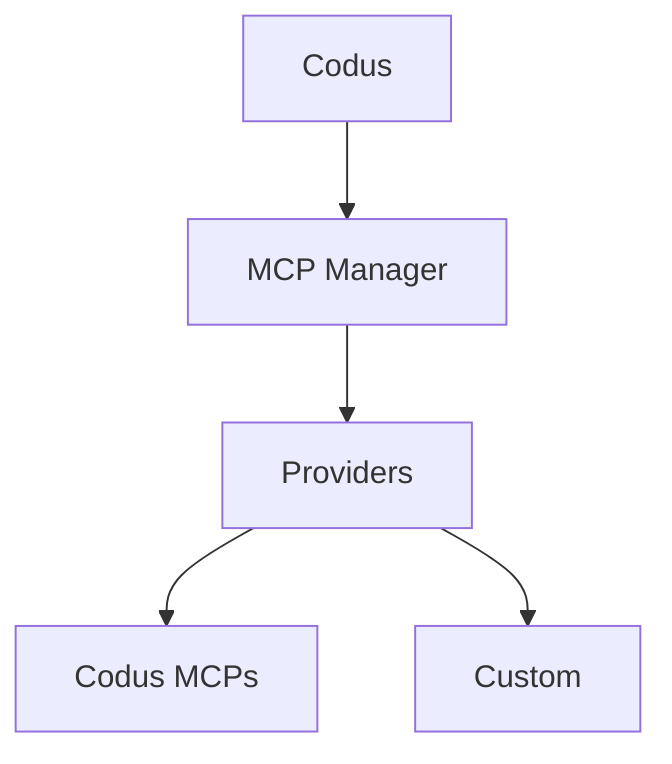

## MCPとは？

Model Context Protocol（MCP）は、LLMアプリが一貫したサーバーインターフェースを通じて外部ツールやデータソースに接続できるオープンスタンダードです。MCPサーバーはツールスキーマとエンドポイントを公開し、Codus/Codyのようなクライアントがワークフロー中にコンテキストを取得したりアクションを実行したりできるようにします。

## MCP Managerのアーキテクチャ

MCP ManagerはCodusのMCP接続を仲介するバックエンドサービスです。プロバイダー、インテグレーション、ワークスペースごとに許可されたツールを追跡し、そのカタログをCodus APIに公開します。

- MCPプロバイダー（Codus、カスタム）の中央レジストリ
- インテグレーションのメタデータ（接続ステータス、MCP URL、許可されたツール）を保存
- プロバイダー固有の認証フローとツール検出を処理
- CodusがMCPツールをリスト・呼び出すために使用するAPIを公開

## CodusのPlugins

MCP Managerに登録されたすべてのものがCodusの**Plugins**スクリーンに表示されるため、チームは各ワークスペースで利用可能なMCPをインストール、管理、有効化できます。

## プロバイダー

### Codusプロバイダー

CodusプロバイダーはCodusが管理するファーストパーティMCPをバンドルしており、Codus MCP、Context7 MCP、Codus Docs MCPが含まれます。

### カスタムプロバイダー

内部システムやサードパーティプラットフォームを統合するためにカスタムプロバイダーを追加できます。セルフホスト型デプロイメントでは、`API_MCP_MANAGER_MCP_PROVIDERS`にプロバイダーをリストし、MCP Managerのコードベースにプロバイダーを実装してください。リファレンス実装はこちらにあります：
[codus-mcp-managerリポジトリ](https://github.com/elchapita43/codus-mcp-manager#-adding-a-new-provider)
