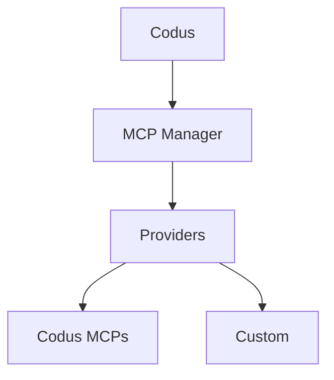

## O que são MCPs?

Model Context Protocol (MCP) é um padrão aberto que permite que aplicativos de LLM se conectem a
ferramentas externas e fontes de dados por meio de uma interface de servidor consistente. Os
servidores MCP publicam esquemas de ferramentas e endpoints para que clientes como o Codus/Cody possam buscar
contexto ou executar ações durante um fluxo de trabalho.

## Arquitetura do MCP Manager

O MCP Manager é o serviço de backend que intermediia essas conexões MCP para
o Codus. Ele rastreia provedores, integrações e ferramentas permitidas por
workspace, e então expõe esse catálogo para a API do Codus.

- Registro central de provedores MCP (Codus e custom)
- Armazena metadados de integração (status de conexão, URL MCP, ferramentas permitidas)
- Gerencia fluxos de autenticação específicos de cada provedor e descoberta de ferramentas
- Expõe APIs usadas pelo Codus para listar e invocar ferramentas MCP

## Plugins no Codus

Tudo que está registrado no MCP Manager aparece na tela de **Plugins** do Codus,
para que sua equipe possa instalar, gerenciar e habilitar os MCPs disponíveis para cada
workspace.

## Provedores

### Provedor Codus

O provedor Codus agrupa MCPs próprios gerenciados pelo Codus, incluindo o
Codus MCP, Context7 MCP e Codus Docs MCP.

### Provedores Customizados

Você pode adicionar provedores customizados para integrar sistemas internos ou plataformas
de terceiros. Em implantações self-hosted, liste o provedor em
`API_MCP_MANAGER_MCP_PROVIDERS`, e então implemente o provedor na base de código do MCP Manager.
A implementação de referência está aqui:
[codus-mcp-manager repo](https://github.com/elchapita43/codus-mcp-manager#-adding-a-new-provider)
