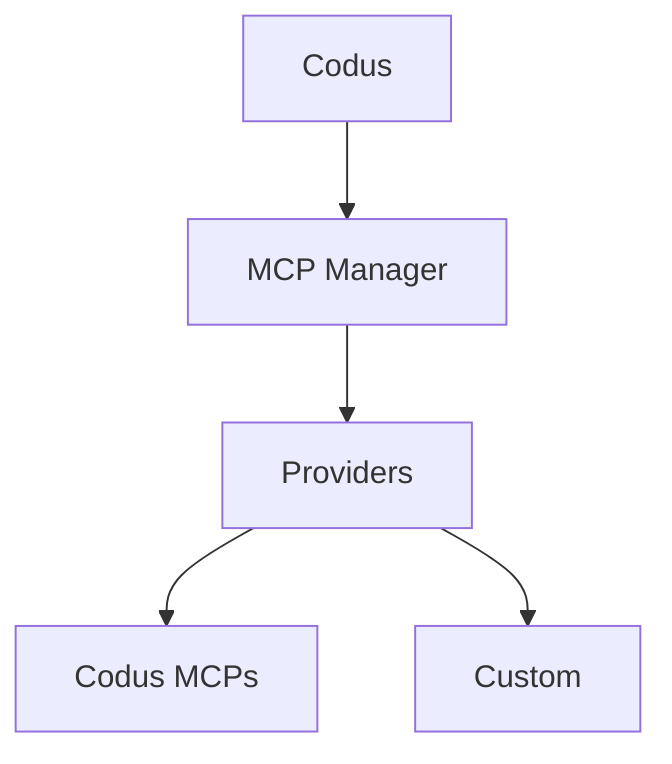

## 什么是 MCP？

Model Context Protocol (MCP) 是一个开放标准，允许 LLM 应用程序通过一致的服务器接口连接到外部工具和数据源。MCP 服务器发布工具架构和端点，以便像 Codus/Cody 这样的客户端可以在工作流程期间获取上下文或运行操作。

## MCP Manager 架构

MCP Manager 是为 Codus 中介这些 MCP 连接的后端服务。它跟踪提供商、集成和每个工作区允许的工具，然后将该目录暴露给 Codus API。

- MCP 提供商的中央注册表（Codus 和自定义）
- 存储集成元数据（连接状态、MCP URL、允许的工具）
- 处理特定于提供商的身份验证流程和工具发现
- 公开 Codus 用于列出和调用 MCP 工具的 API

## Codus 中的插件

在 MCP Manager 中注册的所有内容都显示在 Codus **插件**屏幕中，因此您的团队可以安装、管理和启用每个工作区可用的 MCP。

## 提供商

### Codus 提供商

Codus 提供商捆绑了由 Codus 管理的第一方 MCP，包括 Codus MCP、Context7 MCP 和 Codus Docs MCP。

### 自定义提供商

您可以添加自定义提供商来集成内部系统或第三方平台。在自托管部署中，在 `API_MCP_MANAGER_MCP_PROVIDERS` 中列出提供商，然后在 MCP Manager 代码库中实现该提供商。参考实现位于：
[codus-mcp-manager 仓库](https://github.com/elchapita43/codus-mcp-manager#-adding-a-new-provider)
